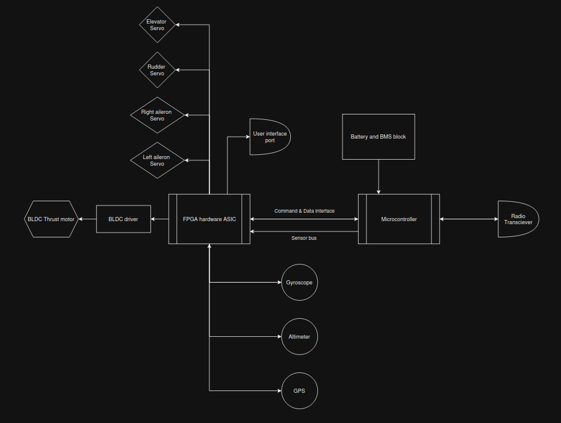
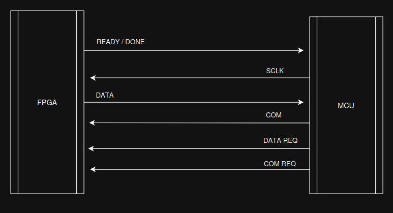
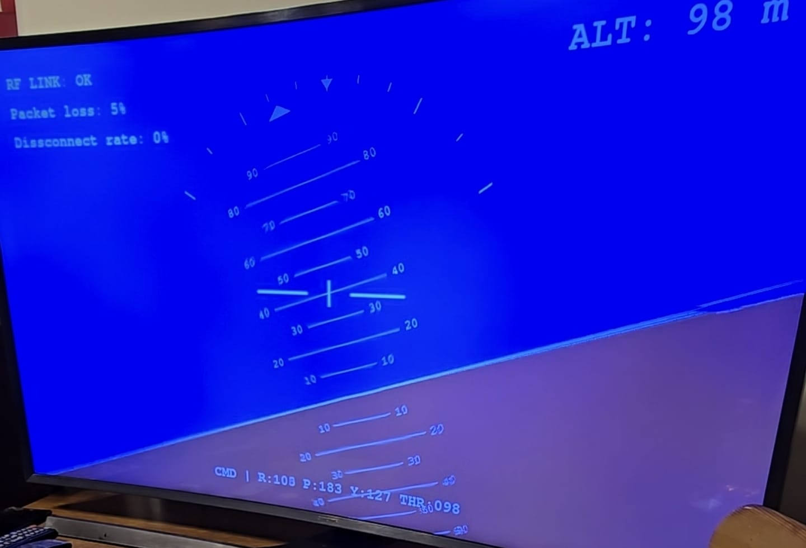
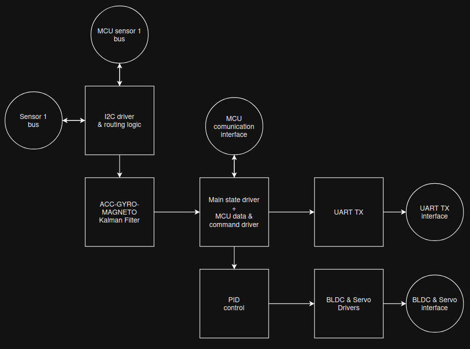

# Public Repo

## Onboard Data & Control Flow

<p align="center">
  
  <br>
  <em>Figure 1: Data & Control Flow block diagram</em>
</p>

> [!IMPORTANT]
> **MCU has acces to onboard sensors via FPGA hardware and priority based on state**

<p align="center">
  
  <br>
  <em>Figure 2: FPGA - MCU custom interface</em>
</p>

> [!IMPORTANT]
> - There are 2 monitors: one for the FPV video input and one for the telemetry and RF connection integrity UI
> - Camera video transmission is a completley sepparate subsystem and is not related nor interract with any of the onboard hardware and software  

<p align="center">
  
  <br>
  <em>Figure 3: IRL 4K monitor/TV UI for telemetry and RF connection integrity</em>
</p>

<p align="center">
  
  <br>
  <em>Figure 4: Version 2.X FPGA block submodules</em>
</p>

#### MCU (master) - FPGA (slave) command protocol over interface
1. Slave asserts READY/DONE high for signaling availability
2. Master sends COM-REQ high and DATA-REQ low for start of transmission
3. Slave asserts READY/DONE low signaling request accept
4. Master sends the data packet over COM line every falling SCLK edge LSB first
5. Master sends COM-REQ low
6. Slave asserts READY/DONE high signaling end of transmission

> #### *Command write packet format*
> | com_id (3-bit) | com/setting (10-bit) |

#### MCU (master) - FPGA (slave) data protocol over interface
1. Slave asserts READY/DONE high for signaling availability
2. Master sends DATA-REQ high and COM-REQ low for start of transmission
3. Slave asserts READY/DONE low signaling request accept
4. Master reads the data packet over the DATA line at every falling edge of the SCLK MSB first
5. Master sends DATA-REQ low
6. Slave asserts READY/DONE high signaling end of transmission

> #### *Data read packet format*
> | onboard state (8-bit) | gyro x (8-bit) | gyro y (8-bit) | gyro z (8-bit) | altitude (8-bit) |

#### Com types based on com_id
- 000 Write UART
- 001 Set Thrust
- 010 Set Roll (Ailerons)
- 011 Set Pitch (Elevators)
- 100 Set Yaw (Rudder)
- 101 Set Flaps / Flaperons 
- 110 MODES 
- 111 NOP (no operation)
 
> [!IMPORTANT]
> #### For safety reasons: once FLIGHT mode, flight-assistant and autopilot are enabled, they cannot be disabled 

##### Payload options for MODES com_id
- 0     nop
- 1023  nop
- 1    Enter GROUNDED mode
- 2    Enter STANDBY mode
- 4    Enter FLIGHT mode (available only in STANDBY mode)
- 8    Enable flight-assistant (available only in FLIGHT mode)
- 16   Enable autopilot (available only if flight-assistant enabled)
- 32   Return home (autopilot)


> [!IMPORTANT]
> #### Onboard system RESET state
> - FPGA has no acces to sensors
> - MCU carries initialization procedure
> #### Onboard system GROUNDED mode
> - MCU has priority over sensors 
> - Thrust setting is not available
> - MCU has no RF connection
> #### Onboard system STANDBY mode
> - FPGA has priority over sensors
> - Thrust setting is not available
> - MCU has RF connection
> #### Onboard system FLIGHT mode
> - Maximum thrust setting
> - MCU and FPGA highly focus on flying instead of data 

#### Onboard initialization sequence
1. Power-on
2. Fast led blink indicating early power-on state
3. MCU sensor initialization
4. MCU gives first console reports to UART through FPGA com
5. MCU sends GROUNDED mode
6. RF to base connection attempt + console report
7. MCU sends STANDBY mode
8. Slow led blink indicating RF connection and STANDBY mode
9.  MCU sends FLIGHT mode
10. No led blink and ready to fly

### RF base -> onboard data byte payload
1. Actions
2. Flight stick roll
3. Flight stick pitch
4. Flight stick yaw
5. Reserved
6. Thrust

#### RF ACTIONS byte options
- 0 NOP
- 1 Enter FLIGHT mode
- 2 Set flaps short
- 3 Set flaps max
- 4 Set flaps long
- 1023 NOP 

### RF onboard -> base data byte ack payload
1. Stari belele alea alea
2. Gyro x
3. Gyro y
4. Gyro z
5. Altitude

### RF bitrate: 250 Kbps
### Camera resolution and fps: 1080p 60 fps

---

## Version 1.4 - Accelerometer, Gyroscope and Magnetometer sensor initialization and FPGA I2C burst read driver 
> [!NOTE]
> - Added the MPU-9250 sensor to the onboard system
> - Added MCU software for sensor intialization and diagnostic
> - Added FPGA drivers for reading the bulk sensor data

#### FPGA resource utilization
##### Intel Cyclone II
```
Total logic elements: 960 / 18752 ( 5% )
LUT:  886
FF:   298
```

#### Onboard MCU resource utilization
##### PIC16LF1708
```
Program memory (W): 4079 ( 100% )
Data memory (B):     167 ( 33% ) 
```

---

## Version 1.3 - Super base telemetry and RF 
> [!NOTE]
> - Updated the base software with better UI, RF control, fiability and efficiency

---

## Version 1.2 - Super base 
> [!NOTE]
> - Modified the base hardware and software to raspberry pi 5 8GB and display app telemetry and flight stick input

---

## Version 1.1 - Onboard MCU-FPGA data request channel 
> [!NOTE]
> - Added MCU-FPGA data functions and drivers
> - Updated MCU onboard software with improved com function
> - Uptaed FPGA with improved com and data state logic


#### FPGA resource utilization
##### Intel Cyclone II
```
Total logic elements: 775 / 18752 ( 4% )
LUT:  733
FF:   202
```

#### Onboard MCU resource utilization
##### PIC16LF1708
```
Program memory (W): 3016 ( 74% )
Data memory (B):     149 ( 29% ) 
```

---

## Version 1.0 - To the sky 
> [!NOTE]
> - Added apropriate state logic and MCU software for flight
> - Updated base software with better packet loss and disconnect rate tracking
> - Updated onboard software with better code for flight efficiency and fiability
> - Removed base real time connection meetrics and replaced them with average values 

> TIP
> Keep RF modules away from close surfaces and obstacles especially the ground

#### FPGA resource utilization
##### Intel Cyclone II
```
Total logic elements: 735 / 18752 ( 4% )
LUT:  703
FF:   187
```

#### Base MCU resource utilization
##### PIC16LF1708
```
Program memory (W): 3418 ( 83% )
Data memory (B):     127 ( 25% ) 
```

#### Onboard MCU resource utilization
##### PIC16LF1708
```
Program memory (W): 2994 ( 72% )
Data memory (B):     149 ( 29% ) 
```

---

## Version 0.9 - RF connection
> [!NOTE]
> - Added onboard RF PRX and ACK payload MCU software
> - Updated MCU onboard software to handle RF PRX and ACK
> - Updated MCU base software to handle RF PTX and ACK
> - Removed onboard servo testing sequence at startup

> [!IMPORTANT]
> - Even tho the onboard FPGA uses 10-bit resolution, the data is scaled down to 8-bit resolution for easier RF data handling

#### RF bitrate: 250 Kbps

#### FPGA resource utilization
##### Intel Cyclone II
```
Total logic elements: 729 / 18752 ( 4% )
LUT:  703
FF:   187
```

#### Onboard MCU resource utilization
##### PIC16LF1708
```
Program memory (W):  2934 ( 72% )
Data memory (B):      154 ( 30% ) 
```

---

## Version 0.8 - Base PTX ACK payload 
> [!NOTE]
> - Added base RF PTX ACK payload MCU software
> - Updated MCU software to include a dedicated recieved data page

#### Base MCU resource utilization
##### PIC16LF1708
```
Program memory (W): 2710 ( 66% )
Data memory (B):     108 ( 21% ) 
```

---

## Version 0.7 - Base setup + local code and PTX software
> [!NOTE]
> - Added base components, layout and setup
> - Added base local drivers
> - Added RF PTX payload components
> - Added RF PTX MCU software
> - Added RF PTX packet loss and disconnects tracking
> - Updated onboard MCU software with better string functions

#### Base MCU resource utilization
##### PIC16LF1708
```
Program memory (W): 2419 ( 59% )
Data memory (B):      97 ( 19% ) 
```

---

## Version 0.6 - Flaperons, Max servo range & Onboard system state 

> [!NOTE]
> - Added flaperons configuration control hardware and com drivers
> - Added onboard GROUNDED, STANDBY and FLIGHT hardware state logic and com drivers
> - Added max position limiter hardware parameter for ailerons, elevators and rudder
> - Modified the command interface packet and payload
> - Modified onboard states and mode configuration
> - Updated MCU software to include flaperons and state testing
> - Removed thrust testing from MCU software 

> [!IMPORTANT]
> Max aileron % MUST be reviewd and set according to the max intended flaperon configuration

#### FPGA resource utilization
##### Intel Cyclone II
```
Total logic elements: 729 / 18752 ( 4% )
LUT:  703
FF:   187
```

#### MCU resource utilization
##### PIC16LF1708
```
Program memory (W): 2901 ( 71% )
Data memory (B):      124 ( 24% ) 
```

---

## Version 0.5 - Onboard battery measurement

> [!NOTE]
> - Added onboard battery measurement with MCU ADC
> - Updated MCU software to include battery test and measurement
> - Upgraded MCU from PIC16LF1707 to PIC16LF1708

> [!IMPORTANT]
> - Battery voltage must be divided by 3 then fed into ADC
> - Max onboard battery voltage: 9.9 V

#### MCU resource utilization
##### PIC16LF1708
```
Program memory (W): 2658 ( 65% )
Data memory (B):     106 ( 21% ) 
```

---

## Version 0.4 - Elevators & Rudder com control

> [!NOTE]
> - Added elevators servo control hardware and com drivers
> - Added rudder servo control hardware and com drivers
> - Updated MCU software check sequence to also include elevator and rudder control  

#### FPGA resource utilization
##### Intel Cyclone II
```
Total logic elements: 615 / 18752 ( 3% )
LUT:  564
FF:   174
```

#### MCU resource utilization
##### PIC16LF1707
```
Program memory (W): 1373 ( 67% )
Data memory (B):      61 ( 24% ) 
```

---

## Version 0.3 - BLDC/Servo driver + Thrust & Roll com control

> [!NOTE]
> - Added bldc thrust control hardware and com drivers
> - Added ailerons servo control hardware and com drivers
> - Updated MCU software to a thrust/ailerons check sequence 

#### FPGA resource utilization
##### Intel Cyclone II
```
Total logic elements: 419 / 18752 ( 2% )
LUT: 384 
FF:  152
```

#### MCU resource utilization
##### PIC16LF1707
```
Program memory (W): 855 ( 42% )
Data memory (B):     49 ( 19% ) 
```

---

## Version 0.2 - Initial development phase

> [!NOTE]
> - Added MCU and FPGA setup
> - Added MCU-FPGA interface
> - Added FPGA UART TX driver
> - Added MCU COM function
> - Added MCU send_char and send_string functions
> - Added FPGA COM-UART pipeline
> - Added FPGA system state led indicator

#### BLDC/Servo signal 
```
PWM Servo / ESC period : 20 ms
Minimum duty cycle: 1 ms
Maximum duty cycle: 2 ms

ESC arming: 1 ms duty cycle for 2-3 seconds until auditory confirmation from motor
```

#### MCU stats
```
Model: PIC16LF1707
Usable I/O count: between 15 - 17
Program mem:  2 KW
RAM: 256 B
ADC: 10-bit
```

